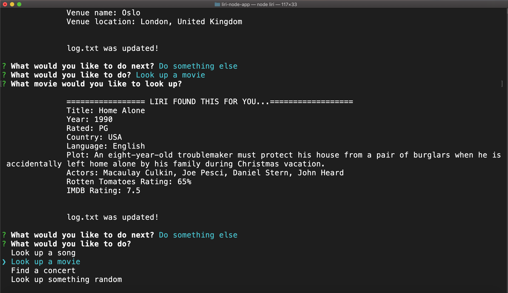

# LIRI Node Application

This application runs through the terminal. When you run Liri with node, you will be prompted with several options of what you would like to do. Liri can look up a song for you, look up a movie, or find an upcoming concert. There is also a look up something random feature! Check out the demo video to see how it works.

If you want to try out LIRI, download all the files, and then run npm install to install all the dependencies in the package.json file. You will also need to set up your own spotify API keys. Once you have them, make a .env file in the liri-node-app directory, and put this in it:

#### Spotify API keys

SPOTIFY_ID=your-id-here

SPOTIFY_SECRET=your-secret-here

## Demos

## Contributing & Support

Contributions are closed at this time. Please reach out with any questions.

## Authors

Gray Atkinson-Adams

## License

[MIT](https://choosealicense.com/licenses/mit/)